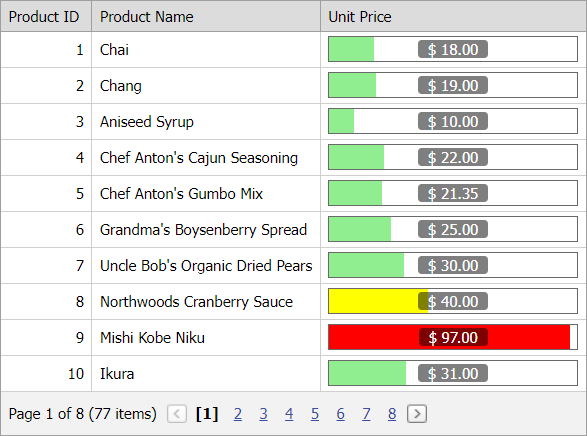

<!-- default badges list -->

<!-- default badges end -->
# Grid View for ASP.NET Web Forms - How to display progress bar controls in data cells
<!-- run online -->
**[[Run Online]](https://codecentral.devexpress.com/e3943/)**
<!-- run online end -->
This example demonstrates how to display [ASPxProgressBar](https://docs.devexpress.com/AspNet/11024/components/data-editors/progressbar) controls in the [ASPxGridView](https://docs.devexpress.com/AspNet/5823/components/grid-view)'s data cells. A progress bar indicator's color depends on the bound value.

Declare [ASPxProgressBar](https://docs.devexpress.com/AspNet/11024/components/data-editors/progressbar) in a data column's [DataItemTemplate](https://docs.devexpress.com/AspNet/DevExpress.Web.GridViewDataColumn.DataItemTemplate) to display progress bar controls in column cells. Handle the progress bar's [DataBound](https://docs.devexpress.com/AspNet/DevExpress.Web.ASPxDataWebControlBase.DataBound) event and set the [IndicatorStyle.BackColor](https://learn.microsoft.com/en-us/dotnet/api/system.web.ui.webcontrols.style.backcolor?view=netframework-4.8.1#System_Web_UI_WebControls_Style_BackColor) property to a color based on the cell value.

## Files to Review

* [Default.aspx](./CS/WebSite/Default.aspx) (VB: [Default.aspx](./VB/WebSite/Default.aspx))
* [Default.aspx.cs](./CS/WebSite/Default.aspx.cs) (VB: [Default.aspx.vb](./VB/WebSite/Default.aspx.vb))

## Documentation

- [Grid View Templates](https://docs.devexpress.com/AspNet/3718/components/grid-view/concepts/templates)
- [Grid View Examples](https://docs.devexpress.com/AspNet/3768/components/grid-view/examples)
